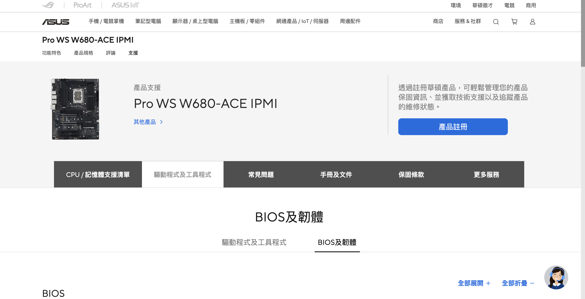

# Pro WS W680-ACE IPMI 手冊及文件

- [Proxmox 設置教學 Repository](https://github.com/detectviz/proxmox-guide)

## 韌體 BIOS 手冊及文件

https://www.asus.com/tw/motherboards-components/motherboards/workstation/pro-ws-w680-ace-ipmi/helpdesk_manual?model2Name=Pro-WS-W680-ACE-IPMI

- 下載 BIOS 及韌體更新檔

[Pro WS W680-ACE / Pro WS W680-ACE IPMI BIOS Manual ( 英文版 )](E23138_Pro_WS_W680-ACE_BIOS_Manual_EM_V2_WEB.pdf)

[Pro WS W680-ACE IPMI BIOS MANUAL ( 繁體中文版 )](Pro_WS_W680-ACE_IPMI_BIOS_MANUAL_TC.pdf)

[Pro WS W680-ACE / Pro WS W680-ACE IPMI 英文版使用手冊](E21247_Pro_WS_W680-ACE_UM_WEB.pdf)

[Pro WS W680-ACE / Pro WS W680-ACE IPMI 繁體中文版使用手冊](T21247_Pro_WS_W680-ACE_UM_WEB.pdf)

## IPMI 手冊及文件

https://www.asus.com/tw/supportonly/asmb10-ikvm/helpdesk_manual

[ASMB10-iKVM English Manual 英文版遠端管理卡使用手冊](E20716_ASMB10-iKVM_UM_V2_WEB.pdf)

[ASMB10-iKVM 繁體中文版遠端管理卡使用手冊](T18037_ASMB10-iKVM_WEB.pdf)